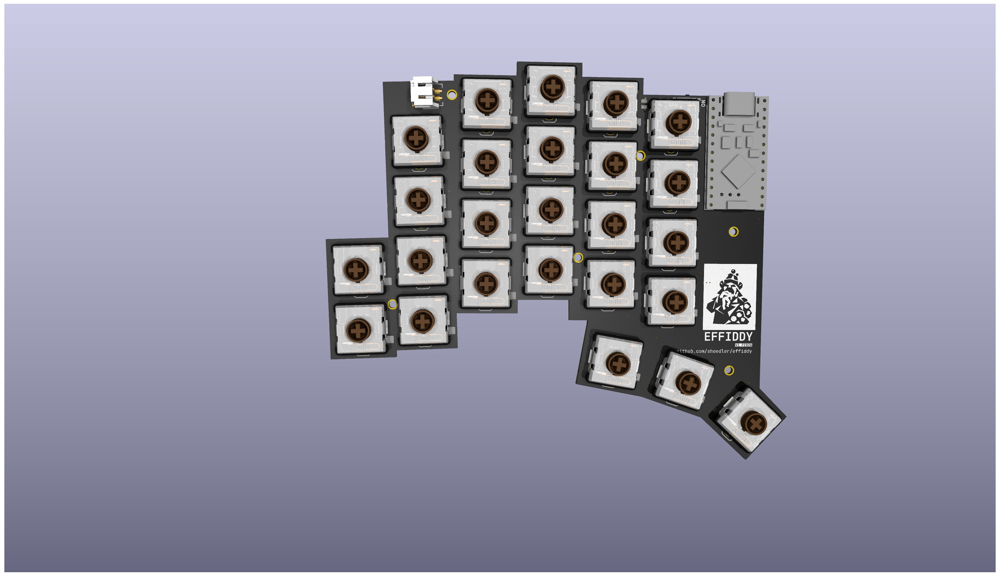
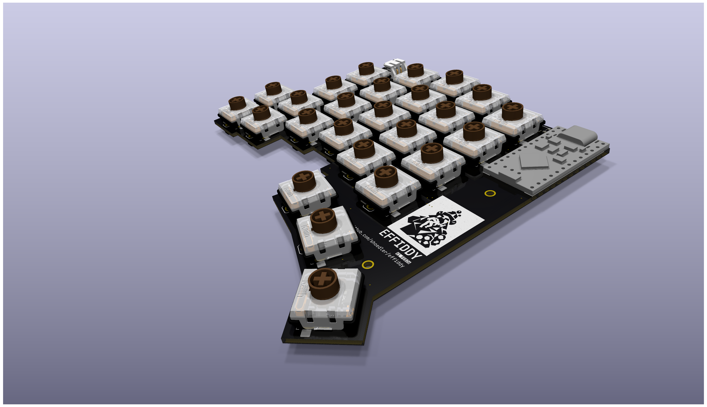

# effiddy
A 50-key, column-staggered, wireless split keyboard, inspired by Totem.

## Effi.. what?
/ˈɛfɪdi/

*effiddy* is a wordplay on **effigy** — a constructed symbolic figure — and *fifty*, referencing the keyboard’s 50 keys.
An **effigy** is a physical representation of an idea, identity, or belief, often ritualistic or iconic in nature.

The design and name are inspired by the **Kindlifresserbrunnen** (Child-Eater Fountain) in Bern, Switzerland:
a striking, unsettling effigy that embodies folklore, symbolism, and cultural memory.
Effiddy adopts this spirit in a minimalist, abstract form — part artifact, part tool.

