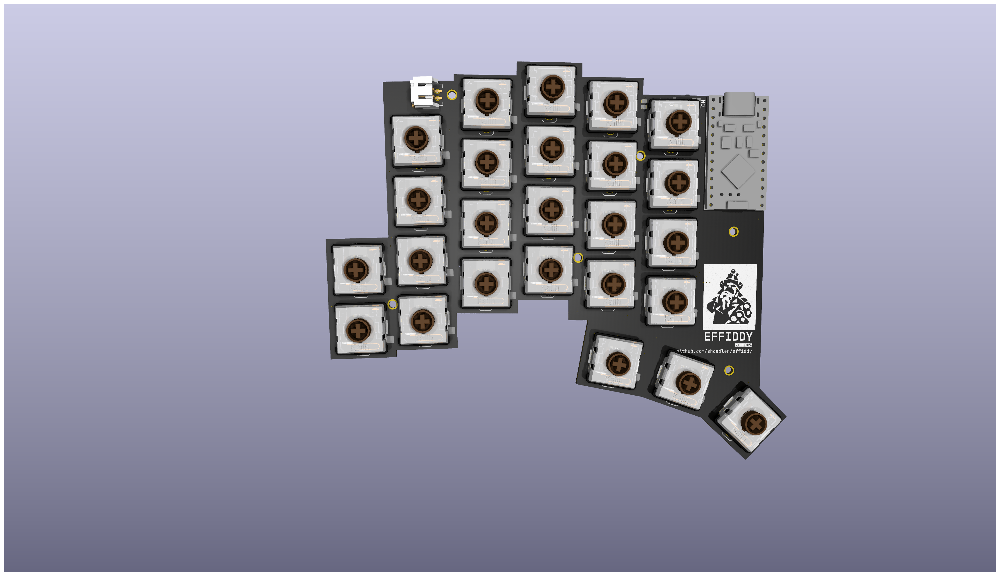
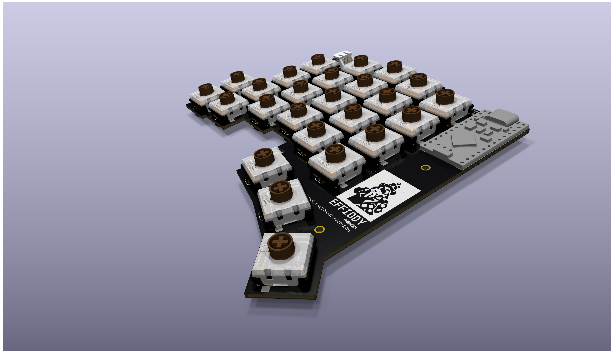

# effiddy
A 50-key, column-staggered, wireless split keyboard, inspired by Totem. Designed for Choc-spacing (16.5 by 17.5mm keycaps) and 1350 Choc v1 or v2 switches.

## Effi.. what?
/ˈɛfɪdi/

*effiddy* is a wordplay on **effigy** — a constructed symbolic figure — and *fifty*, referencing the keyboard’s 50 keys.
An **effigy** is a physical representation of an idea, identity, or belief, often ritualistic or iconic in nature.

The design and name are inspired by the **Kindlifresserbrunnen** (Child-Eater Fountain) in Bern, Switzerland:
a striking, unsettling effigy that embodies folklore, symbolism, and cultural memory.
Effiddy adopts this spirit in a minimalist, abstract form — part artifact, part tool.

> **Design note**
> This project came together as a follow up on the [shoedler54](https://github.com/shoedler/shoedler54) split and is also designed entirely in [ergogen.xyz](ergogen.xyz). Since I wanted effiddy to be as thin as possible, I modeled the backside of the case to include cutouts for the SMD components (hotswap sockets, diodes etc.) which resulted in a very thin keyboard, but also an insanely complex ergogen config. The generation of the stl files literally takes minutes when running ergogen through the browser. The reasonable approach to this would've been to use the 3d kicad model of the PCB to model the backplate in CAD. Though, you'd have to model it for both halves due to hotswap socket placement.

## Impressions

---

## Bill of materials

For one complete board - e.g. two halves - you'll need:

- 2 Promicro NRF52840
- 50 1N4148W SOD-123 Diodes
- 50 Kailh Low-profile 1350 Hotswap Sockets
- 50 Keyswitches, Choc v1 or v2
- 50 1u Choc-spaced (16.5x17.5mm) Keycaps, Choc v1 or v2 stem
- 2 EVQPUL02K Switches ($\to$ board reset button)
- 2 SSSS811101 Switches ($\to$ power switch)
- 2 701535 3.7v, 350mAh Batteries
- 2 JST PH 2.0 THT Sockets

For the case you'll need:

- Obviously, the printed case files. See section about printing below.
- 4 M2x3mm heat set inserts.
- 4 M2x6mm (or 8mm) flathead screws
- 8 Stick-on rubber feet

## Build guide

### PCB manufacturing

> PCB related files are located in the `kicad` directory.

I do not suggest rerouting the PCB for fun. There's premade gerber archive located at `kicad/gerber.zip` which you can use. I've used JLCPCB, default settings (1.6mm two layer PCB) and with the black solder mask.

> [!NOTE]
> There's also a 3d render (.stl) of the assembled PCB in the `kicad` directory if you want to model your own case.

### Printing the case

> Case files are located in the `stl` directory.

I used a Babulab A1 mini and default slicer settings (Bambustudio). Everything was printed in their PLA Matte. For a nice effect, I suggest white for the top and keycaps and black for the bottom.

#### What do I need to print?

You'll need at least:

- 2x `effiddy_case_top.stl`, which is the top part of the case where the keyswitches are mounted into - I recommend using the provided 3mf files for that: `effiddy_case_top_left.3mf` and `effiddy_case_top_right.3mf`. Which are mirrored versions with support enabled for the Mcu + Bat enclosures. (Theoretically, bridging works fine, but support is definitely easier and more predictable)
- 1x `effiddy_case_bottom_left.stl`, and
- 1x `effiddy_case_bottom_right.stl`. These are the bottom part of the case - same story, use the provided 3mf files for that: `effiddy_case_bottom_left.3mf` and `effiddy_case_bottom_right.3mf`. These are **not** just mirrored versions. The bottom part of the case is not mirrorable, due to the hotswap sockets being aligned differently for the left and right. 

> [!NOTE]
> The `effiddy_case_bottom_left.stl` and `right.stl` are generated by ergogen. Due to their complexity, they are cursed and a little bit broken. The shape is not closed, there are multiple naked edges, planar and non-planar holes as well as degenerate faces. Despite that, I had no trouble printing it in Bambustudio.

### Printing the keycaps

> Keycap related files are located in the `scad` directory.

The caps require no supports if you place them on one of the fillets - they do however require good bed adhesion. This, just like the case, was also printed on a Bambulab A1 mini with PLA Matte. Also, like the case, I've provided a 3mf file to print regular and indexing (F/J keys on QWERTY) keys. If you have to use the stl directly:

- Use 0.12mm layer height (including the initial layer).
- Use a brim - if your slicer doesn't automatically generate it, add it manually.
- Use a little manually placed support on the face of the keycap. Centered, about 1/3 the way up the slope. In Bambustudio, the slicer will turn this into a small wedge that is just enough to stabilize the cap but not leave any traces of support material on the keycap face.

> [!NOTE]
> The keycap was designed in [OpenSCAD](openscad.org). It's fully parametrized, so it's easy to adapt to your liking.

### Soldering

Since the PCB is reversible it can get confusing quick. All of the components **except the ProMicro and the JST connector** are soldered to the backside of each half.

1. Solder diodes, hotswap sockets, reset- and powerswitches on the backside of each half. **This is also the side were you bridge all of the solder-jumpers with solder** (8 for the Mcu, 2 for the Battery connector).
2. Direct-solder the ProMicro to the frontside of the PCB, along with the JST connector. (Pin Sockets are also an option for the mcu, if you want - it just makes the keyboard a bit thicker)

> [!CAUTION]
> Before you continue it's a good idea to verify that there's no short between the JSTs +/- terminal as well as the ProMicros VCC and GND.

I suggest to load the firmware next and check that everything works before assembly.

### Loading the ZMK firmware

> Firmware related files consist of: config/, boards/, zephyr/ directories, as well as the build.yml file and the GitHub Actions workflow in .github/workflows.build.yml

Get the latest firmware from https://github.com/shoelder/effiddy/actions, select the latest run and scroll down to Artifacts - you'll be able to download the zip archive from there.

> [!NOTE]
> There'll be two .uf2 files per half in the zip archive - a `de-ch` and an `en` version. This refers to the keycode locale that's been used. I myself require a swiss locale, but, to make the default firmware more useful for more people, I've added an english version too. You can check the keymaps out in the `config/boards/shields/effiddy` directory.

For each half:

1. Plug in the half to your device using a USB cable.
2. Press the reset button twice within 500ms - on my versions of the ProMicro, their red LED breaths gently once you've entered bootloader mode.
3. You'll see a `NICENANO` appear in your device tree. Simply drag and drop the **correct** firmware for the half your working on onto the mcu - it should eject itself automatically once the firmware is flashed.

> [!NOTE]
> If you run into trouble, there's also a `settings_reset` firmware provided in the archive. See [the ZMK troubleshooting guide](https://zmk.dev/docs/troubleshooting/connection-issues#reset-split-keyboard-procedure) on how to flash it.

### Assembly

1. Prep the case tops by installing the two heat set inserts and removing support material. In my case, I have used SMD JST connectors which are a bit too wide for the channel in the case which was resolved with a bit of surgery with a sharp utility knife.
2. Connect the battery. Mount the top case.
3. Install the switches and keys.
4. Flip the whole thing, tuck the battery wires into the channel.
5. Mount the back case half. Install the two screws - done!

---

## References

- Flatfootfox' detailed design guide: https://flatfootfox.com/ergogen-part1-units-points/
- nickcoutsos Keymap-editor: https://nickcoutsos.github.io/keymap-editor/
- nickcoutsos Keymap-layout-tools: https://nickcoutsos.github.io/keymap-layout-tools/
- Joel Spadins zmk-locale-generator for the de-swiss keycode header: https://github.com/joelspadin/zmk-locale-generator
- ZMK guide on how to add a new shield: https://zmk.dev/docs/development/hardware-integration/new-shield
- More of my keyboards:
  - shoedler54 - a cheap 54-key wireless split, inspired by the ZSA Voyager: https://github.com/shoedler/shoedler54
